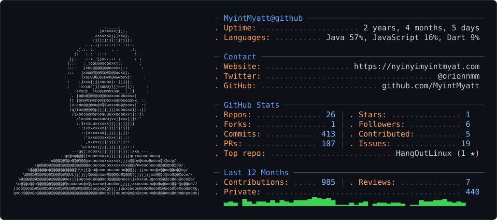

<h1 data-importer="text" align="center">Nyi Nyi Myint Myat (Orion)</h1>

###
<picture>
  <source media="(prefers-color-scheme: dark)" srcset="dark_mode.svg" />
  <source media="(prefers-color-scheme: light)" srcset="light_mode.svg" />
  
</picture>

 

##

 

## About Me
I'm a passionate developer who interests about designing clean, scalable **backend systems , mobile app devlopment** and dedicated to writing detail-oriented, efficient code.
- Currently learning **Apache kafka, grpc, microservice design pattern,Spring boot and Golang**.
- When I've got time to kill, I like building mobile apps and designing sleek, modern UIs with smooth animations.

 

##

 

  
  
  
  
  
  
  
  
  
  
  
  
  
  
  
  
  
  
  
  
  
  
  
  
  
  
  
  
  
  
  
  
  
  
  
  
  
  
  
  
  
  
  
  
  
  
  
  
  

 

##

 

  
  
  
  

 

##

 

  
  

 

##

  

###
